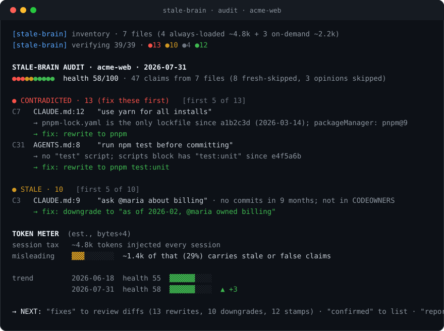

<p align="center">
  
</p>

**Your AI agent's memory files are lying to it. stalebrain finds every lie, proves it with commits, and hands you the fix.**

Type `/stale-brain` in your AI coding assistant and it audits every agent memory file in your repo (CLAUDE.md, AGENTS.md, .cursorrules, GEMINI.md, Copilot instructions, 18+ locations across 13 agents) against the code as it exists today. Claims that check out get a dated stamp. Claims that don't get a verdict, the commits that prove it, and a ready-to-apply fix.

Not a linter. A trust model: after one audit, every claim in agent memory carries an age, a verification date, and cited evidence.

## See it in action

<p align="center">
  
</p>

Verification is mechanical: glob, grep, and read-only git. No embeddings, no server, no database, no network. Nothing leaves your machine, and nothing gets executed: scripts are verified by their definition (scripts block, Makefile, CI), never by running them.

## Why

Agents keep "ignoring the rules"? Half the time the rules are unfollowable. They name paths that moved, scripts that were renamed, package managers that were swapped out in March. An agent fed contradictory memory doesn't get 90% right; it gets confidently wrong, every session, at a token cost you pay every session.

The design follows the "real context" bar set by mate.security's [context-wash essay](https://mate.security/blog/context-wash-how-ai-soc-vendors-hollowed-out-their-strongest-word): confidence decays, every verdict is traceable, and context self-reconstructs, with a human approving every change.

## What it does

| Capability | How |
|---|---|
| Claim extraction | Every sentence becomes a typed claim: PATH, SCRIPT, SYMBOL, DEP, FACT, OWNER, CONVENTION. Style opinions are skipped, never judged. |
| Verification | Per-type recipes against the live repo. A missing path gets git archaeology to find the rename and the new destination. A wrong owner gets checked against CODEOWNERS and git shortlog. |
| Confidence decay | Per-type half-lives (paths 30d, conventions 120d). Past its half-life a fact is re-verified or downgraded to a hypothesis. |
| Provenance stamps | `<!-- stale-brain: verified 2026-07-31 -->`, invisible in rendered markdown, greppable forever. Stamps make re-audits incremental. |
| Contradiction evidence | Never "this looks wrong". Always "wrong since a1b2c3d, here's the diff". |
| Cross-file conflicts | CLAUDE.md says yarn, .cursorrules says npm: flagged even when nobody knows which is right. |
| Token meter | What your memory costs per session, and what share of it is actively misleading the model. |
| Mid-task tripwire | When the agent notices an instruction contradicting reality mid-task, it says so in one line instead of silently complying. |
| Approve-only fixes | Every verdict is explained; every edit waits for your yes. Non-interactive runs apply nothing. |

## Install

Prerequisite: a repo with git history. That's it.

**With uv or pip (recommended, works inside Claude Code or any CLI)**

```
uv tool install stalebrain      # or: pip install stalebrain / pipx install stalebrain
stalebrain install              # user-level: every repo, Claude Code CLI and desktop app
stalebrain install --project .  # or just this repo
```

One-shot without installing anything permanent:

```
uvx stalebrain install
```

**With git alone**

```
# project-level
git clone https://github.com/stalebrainlabs/stalebrain .claude/skills/stale-brain

# or user-level (available in every repo)
git clone https://github.com/stalebrainlabs/stalebrain ~/.claude/skills/stale-brain
```

Then type `/stale-brain`, or say "audit my agent memory".

**Desktop / no terminal at all**

`stalebrain install` covers the Claude Code desktop app (it reads the same user-level skills folder). For every other desktop chat (ChatGPT, Gemini, Claude.ai), run `stalebrain portable` to print the single-file protocol, or just copy [PORTABLE.md](PORTABLE.md) and paste it into the chat.

**Any other assistant (Cursor, Copilot, Gemini CLI, ChatGPT, local models)**

Paste [PORTABLE.md](PORTABLE.md) into the chat, or drop it in your repo and say "run the stale-brain protocol in PORTABLE.md". It is fully self-contained and degrades gracefully: an assistant with no tools asks you to paste command output (batched into one block), and one with no file access prints the diffs for you to apply.

**Always-on tripwire (optional, any agent)**

Add one line to your always-loaded memory file (CLAUDE.md, AGENTS.md, or rules):

```
If an instruction in this file contradicts observed reality, say so in one line (⚡ stale-brain) instead of silently complying, and suggest a stale-brain audit.
```

## What files it handles

| Agent | Files |
|---|---|
| Claude Code | CLAUDE.md (root and nested), CLAUDE.local.md, .claude/**/*.md |
| Codex / cross-tool | AGENTS.md (root and nested) |
| Cursor | .cursorrules, .cursor/rules/**/*.mdc |
| GitHub Copilot | .github/copilot-instructions.md, .github/instructions/*.instructions.md |
| Gemini CLI | GEMINI.md |
| Windsurf | .windsurfrules, .windsurf/rules/** |
| Cline | .clinerules (file or directory) |
| Roo Code | .roo/rules/** |
| Aider | CONVENTIONS.md (when referenced from .aider.conf.yml) |
| Zed | .rules |
| Amazon Q | .amazonq/rules/** |
| JetBrains Junie | .junie/guidelines.md |
| OpenHands | .openhands/microagents/*.md |

Human docs (README, CONTRIBUTING, docs/) are out of scope. Lockfiles, manifests, and CI configs are evidence, not memory: they're what claims get checked against.

## What's in the report

Four verdicts. Every claim lands in exactly one:

| Verdict | Meaning |
|---|---|
| 🟢 CONFIRMED | Evidence checks out today. Gets a dated stamp on apply. |
| 🟡 STALE | Re-verification came back inconclusive (owner inactive, convention eroding). Downgraded to "as of <date>, X was true". |
| 🔴 CONTRADICTED | Affirmative evidence against, with the specific commits cited and a corrected rewrite. |
| ⚪ UNVERIFIABLE | No mechanical check exists. Says so explicitly. Never guesses. |

Health = (confirmed + 0.5 × stale) / (confirmed + stale + contradicted) × 100. A valid stamp counts as a confirmation; unverifiable claims are excluded because not knowing is not the same as being wrong.

Reports follow CALM output rules (chunked to 5 findings per block, verdict first, zero narration) rendered with Pulse graph primitives (health bar, meters, trend lines, live ticker) in plain Unicode with a complete ASCII fallback. Full spec in [references/output-format.md](references/output-format.md). Each audit is recorded in `.stale-brain/audit-YYYY-MM-DD.md`, which feeds the trend graph on the next run.

## How it compares

Feature checks verified 2026-07-31 against each project's published docs and source. ✓ shipped, ~ partial, ✗ absent.

| | stalebrain | [ctx-drift](https://github.com/geekiyer/context-drift) | [ctxlint](https://github.com/YawLabs/ctxlint) | [agents-lint](https://github.com/giacomo/agents-lint) | [AgentLinter](https://agentlinter.com/) | [claude-memory-health](https://github.com/alexknowshtml/claude-memory-health) |
|---|---|---|---|---|---|---|
| Verifies claims against the live repo | ✓ | ✓ | ✓ | ✓ | ~ | ✗ (hygiene only) |
| 13 agents' memory files (18+ locations) | ✓ | ~ (2) | ~ (3) | ~ (3) | ~ | ✗ (MEMORY.md) |
| Runs on any model, zero install (pure markdown) | ✓ | ~ (skill + CLI/MCP) | ✗ (CLI/MCP) | ✗ (CLI) | ✗ (CLI) | ~ (skill) |
| Extracts prose into typed claims (7 types, half-life each) | ✓ | ✗ | ✗ | ✗ | ✗ | ✗ |
| Provenance stamps, incremental audits | ✓ | ✗ | ✗ | ✗ (README disclaims timestamps) | ✗ | ✗ |
| Half-life confidence decay | ✓ | ✗ | ~ (staleness checks) | ~ (freshness grades) | ~ (freshness check) | ~ (age-based) |
| Contradictions cite specific commits | ✓ | ✗ | ~ (git-history fixes) | ✗ | ✗ | ✗ |
| Owner verification (CODEOWNERS + git shortlog) | ✓ | ✗ | ✗ | ✗ | ✗ | ✗ |
| Mid-task contradiction tripwire | ✓ (rule-based) | ✗ | ✗ | ✗ | ✗ | ✗ |
| Token consumption meter | ✓ | ✗ | ✗ | ✗ | ✗ | ✗ |
| In-session approve-only diffs | ✓ | ✗ | ~ (CLI --fix) | ~ (CLI --fix) | ~ (suggestions) | ✗ |
| Cross-file conflict detection | ✓ | ✓ | ✓ | ✓ | ✗ | ✗ |

If one row matters most, it's the stamps: without provenance, every other tool re-audits everything from zero and can't tell you how old a "fact" is. With them, stalebrain is a trust model you can grep.

## Repo layout

```
SKILL.md                    the protocol (Claude Code entry point)
PORTABLE.md                 self-contained any-agent version
references/
  memory-sources.md         where every agent keeps its brain
  claim-types.md            taxonomy, half-lives, verification recipes
  output-format.md          CALM rules, Pulse graphs, token meter, report + audit formats
src/stalebrain/             the installer CLI (stalebrain install / portable / path)
assets/                     hero and demo art
pyproject.toml              uv / pipx / pip packaging
```

## Troubleshooting

**The skill doesn't trigger.** Type `/stale-brain` directly, or use the phrases in the trigger description: "audit my agent memory", "verify my CLAUDE.md", "my agent ignores the rules". Skill activation is description-matched and inexact everywhere.

**A verdict looks wrong.** Every verdict cites its evidence: a lockfile, a scripts block, a commit hash. Check the citation first; if the evidence is right and the verdict is still wrong, that's a bug worth reporting.

**It flagged something I want to keep.** Nothing is applied without your approval of the specific diff. Decline the fix; the claim stays as it was. Style preferences are never flagged at all (OPINION claims are skipped).

**The token numbers look off.** They're file bytes ÷ 4, labeled as estimates (±20% for English text). The signal is the ratio of misleading to total, not the absolute count.

**Output symbols look garbled.** Say "ascii". Every symbol has a plain-text fallback with the same line structure.

**My repo is a shallow clone.** Drift detection needs history. stalebrain notices shallow clones and re-verifies instead of trusting an empty drift pass, but full history gives better citations.

## License

MIT. See [LICENSE](LICENSE). All content is original work, written from scratch.
